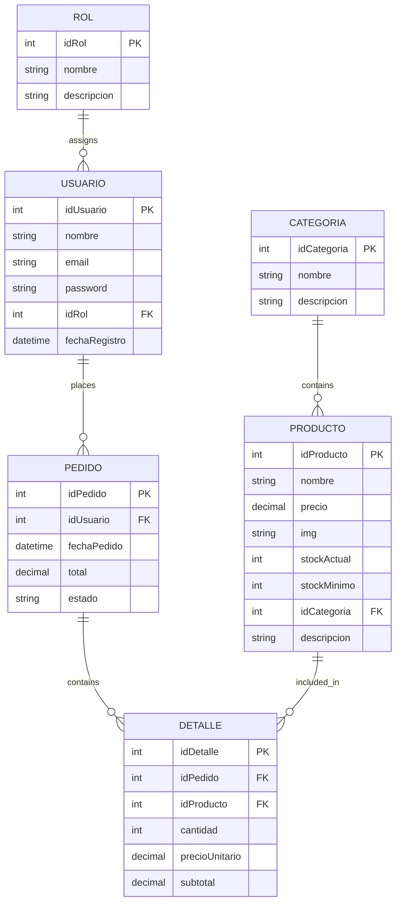
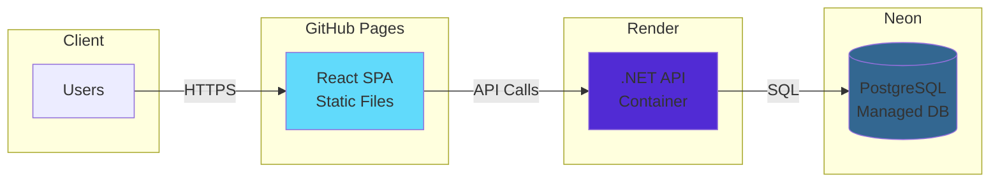

# System Architecture

Huellitas Pet Shop follows a modern three-tier architecture that separates concerns between presentation, business logic, and data persistence. This design ensures scalability, maintainability, and testability.

## Architecture Overview

```mermaid
graph TB
    subgraph "Client Layer"
        Browser[Web Browser]
        ReactApp[React SPA]
    end
    
    subgraph "Application Layer"
        API[Huellitas.API<br/>Controllers]
        Service[Huellitas.Service<br/>Business Logic]
    end
    
    subgraph "Data Layer"
        Data[Huellitas.Data<br/>Repositories]
        EF[Entity Framework Core]
        DB[(PostgreSQL<br/>Database)]
    end
    
    subgraph "Core"
        Core[Huellitas.Core<br/>Entities & Interfaces]
    end
    
    Browser --> ReactApp
    ReactApp -->|HTTP/JSON| API
    API --> Service
    Service --> Data
    Data --> EF
    EF --> DB
    
    Service -.->|Uses| Core
    Data -.->|Implements| Core
    API -.->|References| Core
    
    style ReactApp fill:#61DAFB
    style API fill:#512BD4
    style Service fill:#512BD4
    style Data fill:#512BD4
    style Core fill:#512BD4
    style DB fill:#336791
```

## Frontend Architecture (React SPA)

The frontend is a Single Page Application built with React that provides a dynamic, responsive user interface.

### Technology Stack

<CardGroup cols={2}>
  <Card title="React 18" icon="react">
    Modern UI library with hooks, context, and functional components
  </Card>
  <Card title="React Router Dom" icon="route">
    Client-side routing for seamless navigation
  </Card>
  <Card title="Axios" icon="plug">
    Promise-based HTTP client for API communication
  </Card>
  <Card title="Vite" icon="bolt">
    Lightning-fast build tool and dev server
  </Card>
</CardGroup>

### Component Structure

```
huellitas-frontend/
├── src/
│   ├── App.jsx                 # Root component with routing
│   ├── main.jsx               # Application entry point
│   ├── components/            # Reusable UI components
│   │   ├── Header.jsx
│   │   ├── Footer.jsx
│   │   ├── FilterSidebar.jsx
│   │   ├── Producto/
│   │   │   └── ProductCard.jsx
│   │   ├── Carrito/
│   │   │   ├── CarritoItem.jsx
│   │   │   ├── CarritoResumen.jsx
│   │   │   └── CarritoVacio.jsx
│   │   ├── Login/
│   │   │   ├── LoginForm.jsx
│   │   │   ├── RegisterForm.jsx
│   │   │   └── AuthUI.jsx
│   │   └── Contacto/
│   │       ├── ContactoForm.jsx
│   │       └── ContactoInfo.jsx
│   ├── pages/                 # Page components
│   │   ├── Home/
│   │   │   └── Inicio.jsx
│   │   ├── Cart/
│   │   │   └── Carrito.jsx
│   │   ├── Contact/
│   │   │   └── Contacto.jsx
│   │   ├── Login/
│   │   │   └── Login.jsx
│   │   └── Admin/
│   │       └── AdminPanel.jsx
│   ├── hooks/                 # Custom React hooks
│   │   ├── useProductos.js
│   │   ├── useCarrito.js
│   │   ├── useLoginForm.js
│   │   ├── useRegisterForm.js
│   │   ├── useContacto.js
│   │   └── useFiltros.js
│   └── context/               # Global state management
│       └── CarritoContext.jsx
└── public/
    └── img/                   # Static assets
```

### Routing Configuration

The application uses React Router for client-side navigation:

```jsx
import { Routes, Route, useLocation } from "react-router-dom";
import Header from "./components/Header";
import Footer from "./components/Footer";
import Inicio from "./pages/Home/Inicio";
import Contacto from "./pages/Contact/Contacto";
import Login from "./pages/Login/Login";
import AdminPanel from "./pages/Admin/AdminPanel";
import Carrito from "./pages/Cart/Carrito";

function App() {
  const location = useLocation();
  const isAdmin = location.pathname.startsWith("/admin");

  return (
    <div style={{ display: "flex", flexDirection: "column", minHeight: "100vh" }}>
      {!isAdmin && <Header />}
      
      <main style={{ flex: 1, width: "100%" }}>
        <Routes>
          <Route path="/" element={<Inicio />} />
          <Route path="/contacto" element={<Contacto />} />
          <Route path="/carrito" element={<Carrito />} />
          <Route path="/login" element={<Login />} />
          <Route path="/admin" element={<AdminPanel />} />
        </Routes>
      </main>
      
      {!isAdmin && <Footer />}
    </div>
  );
}
```

<Note>
  The admin panel uses a different layout without the header and footer for a focused dashboard experience.
</Note>

### Custom Hooks Pattern

Huellitas uses custom hooks to encapsulate data fetching and state management logic:

```javascript
// hooks/useProductos.js
import { useState, useEffect } from 'react';

export const useProductos = () => {
  const [productos, setProductos] = useState([]);
  const [cargando, setCargando] = useState(true);

  useEffect(() => {
    const obtenerProductos = async () => {
      try {
        const respuesta = await fetch('https://petshophuellitas.onrender.com/api/Productos');
        const datos = await respuesta.json();
        setProductos(datos);
        setCargando(false);
      } catch (error) {
        console.error("Error al cargar productos:", error);
        setCargando(false);
      }
    };

    obtenerProductos();
  }, []);
  
  return { productos, cargando };
};
```

### State Management

The application uses a combination of:
- **Local component state** for UI interactions
- **Context API** for global cart state
- **LocalStorage** for cart persistence
- **Custom hooks** for data fetching and business logic

## Backend Architecture (.NET API)

The backend follows a clean, layered architecture with clear separation of concerns.

### Solution Structure

The .NET solution consists of four projects:

<AccordionGroup>
  <Accordion title="Huellitas.API - Presentation Layer">
    **Purpose:** HTTP endpoints and controllers
    
    **Responsibilities:**
    - Handle HTTP requests and responses
    - Route management
    - Input validation
    - Authentication and authorization
    - API documentation (Swagger)
    
    **Key Files:**
    ```
    Huellitas.API/
    ├── Controllers/
    │   ├── ProductosController.cs
    │   ├── PedidosController.cs
    │   └── AuthController.cs
    ├── Program.cs              # App configuration
    ├── appsettings.json        # Configuration
    └── Huellitas.API.csproj
    ```
    
    **Example Controller:**
    ```csharp
    [Route("api/[controller]")]
    [ApiController]
    public class ProductosController : ControllerBase
    {
        private readonly IProductoService _productoService;

        public ProductosController(IProductoService productoService)
        {
            _productoService = productoService;
        }

        [HttpGet]
        public async Task<ActionResult<IEnumerable<Producto>>> GetProductos()
        {
            var productos = await _productoService.ObtenerProductosAsync();
            return Ok(productos);
        }

        [HttpGet("{idProducto}")]
        public async Task<ActionResult<Producto>> GetProducto(int id)
        {
            var producto = await _productoService.ObtenerProductoPorIdAsync(id);
            if (producto == null)
            {
                return NotFound("El producto no existe");
            }
            return Ok(producto);
        }

        [HttpPost]
        public async Task<ActionResult<Producto>> PostProducto(Producto producto)
        {
            try
            {
                var nuevoProducto = await _productoService.CrearProductoAsync(producto);
                return CreatedAtAction(nameof(GetProducto), 
                    new { id = nuevoProducto.idProducto }, nuevoProducto);
            }
            catch (SystemException ex)
            {
                return BadRequest(ex.Message);
            }
        }
    }
    ```
  </Accordion>
  
  <Accordion title="Huellitas.Service - Business Logic Layer">
    **Purpose:** Business rules and validation
    
    **Responsibilities:**
    - Implement business logic
    - Data validation
    - Error handling
    - DTO mapping
    - Service coordination
    
    **Key Files:**
    ```
    Huellitas.Service/
    ├── ProductoService.cs
    ├── PedidoService.cs
    ├── AuthService.cs
    ├── Interfaces/
    │   ├── IProductoService.cs
    │   ├── IPedidoService.cs
    │   └── IAuthService.cs
    └── Huellitas.Service.csproj
    ```
    
    **Example Service Interface:**
    ```csharp
    public interface IProductoService
    {
        Task<IEnumerable<Producto>> ObtenerProductosAsync();
        Task<Producto> ObtenerProductoPorIdAsync(int id);
        Task<Producto> CrearProductoAsync(Producto producto);
        Task ActualizarProductoAsync(int id, Producto producto);
        Task<bool> EliminarProductoAsync(int id);
    }
    ```
  </Accordion>
  
  <Accordion title="Huellitas.Data - Data Access Layer">
    **Purpose:** Database operations and context
    
    **Responsibilities:**
    - Database context configuration
    - Repository implementations
    - Entity Framework migrations
    - Query optimization
    - Data access patterns
    
    **Key Files:**
    ```
    Huellitas.Data/
    ├── HuellitasContext.cs
    ├── Repositorios/
    │   ├── ProductoRepositorio.cs
    │   ├── PedidoRepositorio.cs
    │   └── UsuarioRepositorio.cs
    ├── Migrations/
    │   ├── 20251226222715_Inicial.cs
    │   ├── 20251226224227_AgregandoTablasRestantes.cs
    │   └── 20251229094729_AgregoDescripcion.cs
    └── Huellitas.Data.csproj
    ```
    
    **Database Context:**
    ```csharp
    using Huellitas.Core.Entities;
    using Microsoft.EntityFrameworkCore;

    namespace Huellitas.Data
    {
        public class HuellitasContext : DbContext
        {
            public HuellitasContext(DbContextOptions<HuellitasContext> options) 
                : base(options)
            {
            }

            // DbSets represent database tables
            public DbSet<Producto> Productos { get; set; }
            public DbSet<Categoria> Categorias { get; set; }
            public DbSet<Usuario> Usuarios { get; set; }
            public DbSet<Rol> Roles { get; set; }
            public DbSet<Pedido> Pedidos { get; set; }
            public DbSet<Detalle> Detalles { get; set; }
        }
    }
    ```
  </Accordion>
  
  <Accordion title="Huellitas.Core - Domain Layer">
    **Purpose:** Core entities and contracts
    
    **Responsibilities:**
    - Define domain entities
    - Interface contracts
    - Domain models
    - Shared constants
    - No dependencies on other layers
    
    **Key Files:**
    ```
    Huellitas.Core/
    ├── Entities/
    │   ├── Producto.cs
    │   ├── Categoria.cs
    │   ├── Usuario.cs
    │   ├── Rol.cs
    │   ├── Pedido.cs
    │   └── Detalle.cs
    ├── Interfaces/
    │   ├── IProductoRepositorio.cs
    │   ├── IPedidoRepositorio.cs
    │   └── IUsuarioRepositorio.cs
    └── Huellitas.Core.csproj
    ```
    
    **Example Entity:**
    ```csharp
    using System.ComponentModel.DataAnnotations;
    using System.ComponentModel.DataAnnotations.Schema;

    namespace Huellitas.Core.Entities
    {
        [Table("producto")]
        public class Producto
        {
            [Key]
            public int idProducto { get; set; }
            
            [Required]
            [MaxLength(100)]
            public string nombre { get; set; } = string.Empty;
            
            [Column(TypeName = "decimal(18,2)")]
            public decimal precio { get; set; }
            
            public string img { get; set; } = string.Empty;
            public int stockActual { get; set; }
            public int stockMinimo { get; set; }
            public int idCategoria { get; set; }
            
            [ForeignKey("idCategoria")]
            public virtual Categoria Categoria { get; set; } = null!;
            
            public string descripcion { get; set; } = string.Empty;
        }
    }
    ```
  </Accordion>
</AccordionGroup>

### Dependency Injection Configuration

Services are registered in `Program.cs` using dependency injection:

```csharp
using Microsoft.EntityFrameworkCore;
using Huellitas.Data;
using Huellitas.Core.Interfaces;
using Huellitas.Service;

var builder = WebApplication.CreateBuilder(args);

// Database context
builder.Services.AddDbContext<HuellitasContext>(options =>
    options.UseNpgsql(builder.Configuration.GetConnectionString("DefaultConnection")));

// Repository and Service registration
builder.Services.AddScoped<IProductoRepositorio, ProductoRepositorio>();
builder.Services.AddScoped<IProductoService, ProductoService>();
builder.Services.AddScoped<IUsuarioRepositorio, UsuarioRepositorio>();
builder.Services.AddScoped<IAuthService, AuthService>();

// CORS policy
builder.Services.AddCors(options =>
{
    options.AddPolicy("PermitirFrontend",
        policy =>
        {
            policy.AllowAnyOrigin()
                  .AllowAnyHeader()
                  .AllowAnyMethod();
        });
});

var app = builder.Build();

// Middleware pipeline
app.UseHttpsRedirection();
app.UseCors("PermitirFrontend");
app.UseAuthentication();
app.UseAuthorization();
app.MapControllers();

app.Run();
```

### Authentication & Authorization

Huellitas uses JWT (JSON Web Tokens) for secure authentication:

```csharp
using Microsoft.AspNetCore.Authentication.JwtBearer;
using Microsoft.IdentityModel.Tokens;
using System.Text;

var jwtSettings = builder.Configuration.GetSection("Jwt");
var secretKey = jwtSettings["Key"];
var key = Encoding.ASCII.GetBytes(secretKey);

builder.Services.AddAuthentication(options =>
{
    options.DefaultAuthenticateScheme = JwtBearerDefaults.AuthenticationScheme;
    options.DefaultChallengeScheme = JwtBearerDefaults.AuthenticationScheme;
})
.AddJwtBearer(options =>
{
    options.TokenValidationParameters = new TokenValidationParameters
    {
        ValidateIssuerSigningKey = true,
        IssuerSigningKey = new SymmetricSecurityKey(key),
        ValidateIssuer = true,
        ValidIssuer = jwtSettings["Issuer"],
        ValidateAudience = true,
        ValidAudience = jwtSettings["Audience"],
        ValidateLifetime = true
    };
});
```

## Database Architecture (PostgreSQL)

The database follows a normalized relational schema designed for data consistency and integrity.

### Database Schema


### Main Tables

<CardGroup cols={2}>
  <Card title="producto" icon="box">
    **Columns:** idProducto (PK), nombre, precio, img, stockActual, stockMinimo, idCategoria (FK), descripcion
    
    Stores product catalog with pricing, inventory, and categorization.
  </Card>
  
  <Card title="categoria" icon="tags">
    **Columns:** idCategoria (PK), nombre, descripcion
    
    Product categories for organization and filtering.
  </Card>
  
  <Card title="usuario" icon="user">
    **Columns:** idUsuario (PK), nombre, email, password, idRol (FK), fechaRegistro
    
    User accounts with authentication credentials and role assignment.
  </Card>
  
  <Card title="rol" icon="shield">
    **Columns:** idRol (PK), nombre, descripcion
    
    User roles for authorization (admin, customer, etc.).
  </Card>
  
  <Card title="pedido" icon="receipt">
    **Columns:** idPedido (PK), idUsuario (FK), fechaPedido, total, estado
    
    Customer orders with status tracking.
  </Card>
  
  <Card title="detalle" icon="list">
    **Columns:** idDetalle (PK), idPedido (FK), idProducto (FK), cantidad, precioUnitario, subtotal
    
    Order line items linking products to orders.
  </Card>
</CardGroup>

### Relationships



### Entity Framework Code-First Approach

The database schema is defined through C# entity classes and created using migrations:

```bash
# Create a new migration
dotnet ef migrations add MigrationName

# Apply migration to database
dotnet ef database update

# Rollback migration
dotnet ef database update PreviousMigrationName
```

<Tip>
  The code-first approach allows version control of database schema changes and makes team collaboration easier.
</Tip>

## Data Flow

Let's trace a complete request from the browser to the database:

<Steps>
  <Step title="User Action">
    User clicks on a product in the React app to view details
  </Step>
  
  <Step title="API Request">
    The `useProductos` hook makes an HTTP GET request:
    ```javascript
    const respuesta = await fetch(
      'https://petshophuellitas.onrender.com/api/Productos/123'
    );
    ```
  </Step>
  
  <Step title="Controller Receives Request">
    The `ProductosController` handles the request:
    ```csharp
    [HttpGet("{idProducto}")]
    public async Task<ActionResult<Producto>> GetProducto(int id)
    {
        var producto = await _productoService.ObtenerProductoPorIdAsync(id);
        return Ok(producto);
    }
    ```
  </Step>
  
  <Step title="Service Layer Processing">
    The `ProductoService` implements business logic:
    ```csharp
    public async Task<Producto> ObtenerProductoPorIdAsync(int id)
    {
        var producto = await _productoRepositorio.ObtenerPorIdAsync(id);
        if (producto == null)
            throw new NotFoundException("Producto no encontrado");
        return producto;
    }
    ```
  </Step>
  
  <Step title="Repository Data Access">
    The `ProductoRepositorio` queries the database:
    ```csharp
    public async Task<Producto> ObtenerPorIdAsync(int id)
    {
        return await _context.Productos
            .Include(p => p.Categoria)
            .FirstOrDefaultAsync(p => p.idProducto == id);
    }
    ```
  </Step>
  
  <Step title="Database Query">
    Entity Framework generates and executes SQL:
    ```sql
    SELECT p.*, c.*
    FROM producto p
    INNER JOIN categoria c ON p.idCategoria = c.idCategoria
    WHERE p.idProducto = 123;
    ```
  </Step>
  
  <Step title="Response Journey">
    Data flows back up the layers:
    1. Database returns rows
    2. EF Core maps to `Producto` entity
    3. Repository returns entity to service
    4. Service returns to controller
    5. Controller serializes to JSON
    6. HTTP response sent to client
  </Step>
  
  <Step title="UI Update">
    React receives JSON and updates the component:
    ```javascript
    const datos = await respuesta.json();
    setProductos(datos);
    ```
  </Step>
</Steps>

## Design Patterns

Huellitas implements several industry-standard design patterns:

### Repository Pattern

**Purpose:** Abstracts data access logic and provides a collection-like interface for domain entities.

**Benefits:**
- Decouples business logic from data access
- Makes testing easier (mock repositories)
- Centralizes data access logic
- Provides consistent API across different data sources

### Dependency Injection

**Purpose:** Inverts control by injecting dependencies rather than creating them.

**Benefits:**
- Improves testability
- Reduces coupling between components
- Makes code more maintainable
- Supports configuration-based behavior

### DTO (Data Transfer Object)

**Purpose:** Transfers data between layers without exposing internal structure.

**Benefits:**
- Protects sensitive information
- Reduces over-fetching
- Allows independent evolution of layers
- Optimizes network payload

### Service Layer Pattern

**Purpose:** Encapsulates business logic separate from controllers and repositories.

**Benefits:**
- Centralizes business rules
- Promotes code reuse
- Simplifies testing
- Clear separation of concerns

## Performance Considerations

<CardGroup cols={2}>
  <Card title="Async/Await" icon="clock">
    All I/O operations use async/await for non-blocking execution and better scalability.
  </Card>
  
  <Card title="Entity Framework Optimization" icon="database">
    Strategic use of `.Include()` for eager loading and avoiding N+1 query problems.
  </Card>
  
  <Card title="React Hooks Memoization" icon="memory">
    Custom hooks optimize re-renders and prevent unnecessary API calls.
  </Card>
  
  <Card title="LocalStorage Caching" icon="hard-drive">
    Cart data persists in browser storage to reduce server requests.
  </Card>
</CardGroup>

## Security Architecture

<AccordionGroup>
  <Accordion title="JWT Authentication">
    - Stateless token-based authentication
    - Tokens contain user claims and roles
    - Configurable expiration times
    - Secure key management via configuration
  </Accordion>
  
  <Accordion title="CORS Configuration">
    - Controlled cross-origin access
    - Configurable allowed origins
    - Header and method restrictions
    - Production-ready policy
  </Accordion>
  
  <Accordion title="HTTPS Enforcement">
    - All communication over encrypted connections
    - Automatic HTTP to HTTPS redirection
    - Secure cookie flags
  </Accordion>
  
  <Accordion title="Input Validation">
    - Data annotations on entities
    - Controller-level validation
    - Service-layer business rule validation
    - SQL injection prevention via EF parameterization
  </Accordion>
</AccordionGroup>

## Deployment Architecture



### Hosting Details

<CardGroup cols={3}>
  <Card title="Frontend" icon="github">
    **Platform:** GitHub Pages
    
    **Type:** Static site hosting
    
    **CDN:** Global edge network
    
    **Deployment:** Automated via `npm run deploy`
  </Card>
  
  <Card title="Backend" icon="server">
    **Platform:** Render
    
    **Type:** Container-based hosting
    
    **Scaling:** Automatic
    
    **Deployment:** Git push to deploy
  </Card>
  
  <Card title="Database" icon="database">
    **Platform:** Neon
    
    **Type:** Managed PostgreSQL
    
    **Backup:** Automated
    
    **Scaling:** Serverless
  </Card>
</CardGroup>

## Scalability & Extensibility

The architecture is designed to support future growth:

<Tip>
  The layered architecture makes it easy to:
  - Add new features without breaking existing code
  - Replace implementations (e.g., switch databases)
  - Scale horizontally by deploying multiple API instances
  - Add caching layers (Redis, CDN)
  - Implement microservices for specific domains
</Tip>

## Next Steps

Now that you understand the architecture:

<CardGroup cols={2}>
  <Card title="Explore the Code" icon="code">
    Clone the repository and examine the implementation details
  </Card>
  <Card title="API Documentation" icon="book">
    Visit `/swagger` on the backend to see interactive API docs
  </Card>
  <Card title="Contribute" icon="code-pull-request">
    Submit issues or pull requests on GitHub
  </Card>
  <Card title="Build Features" icon="wrench">
    Use this architecture as a foundation for your own features
  </Card>
</CardGroup>

---

<Note>
  This documentation reflects the current state of the project. As Huellitas evolves with new features like ML recommendations and predictive analytics, the architecture will be updated accordingly.
</Note>