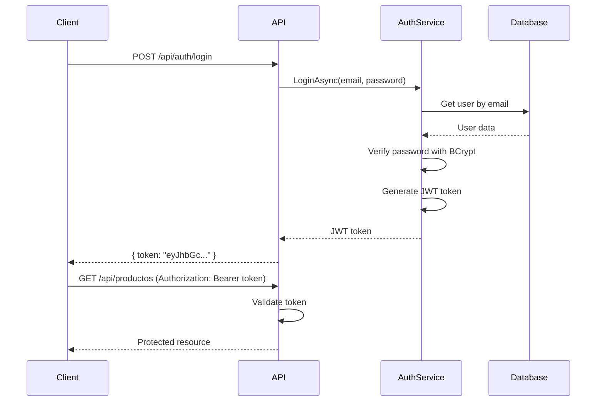

## Overview

Huellitas uses **JSON Web Tokens (JWT)** for stateless authentication. Users receive a token after successful login, which they include in subsequent requests to access protected resources.

## Authentication Flow



## JWT Configuration

### appsettings.json

Configure JWT settings in your configuration file:

```json
{
  "Jwt": {
    "Key": "your-super-secure-secret-key-at-least-32-characters-long",
    "Issuer": "HuellitasAPI",
    "Audience": "HuellitasClients"
  }
}
```

<Warning>
  The `Key` must be at least 32 characters for HMAC SHA-256 encryption. Never commit production keys to version control.
</Warning>

### Program.cs Configuration

JWT authentication is configured in `Program.cs:14-42`:

```csharp Program.cs:14
// Load JWT settings from appsettings.json
var jwtSettings = builder.Configuration.GetSection("Jwt");
var secretKey = jwtSettings["Key"];

if (string.IsNullOrEmpty(secretKey))
{
    throw new Exception("¡ERROR FATAL! No se encontró la propiedad 'Key' dentro de la sección 'Jwt' en appsettings.json.");
}

var key = Encoding.ASCII.GetBytes(secretKey);

// Register JWT authentication
builder.Services.AddAuthentication(options =>
{
    options.DefaultAuthenticateScheme = JwtBearerDefaults.AuthenticationScheme;
    options.DefaultChallengeScheme = JwtBearerDefaults.AuthenticationScheme;
})
.AddJwtBearer(options =>
{
    options.TokenValidationParameters = new TokenValidationParameters
    {
        ValidateIssuerSigningKey = true,
        IssuerSigningKey = new SymmetricSecurityKey(key),
        ValidateIssuer = true,
        ValidIssuer = jwtSettings["Issuer"],
        ValidateAudience = true,
        ValidAudience = jwtSettings["Audience"],
        ValidateLifetime = true  // Check token expiration
    };
});
```

### Middleware Order

Authentication and authorization middleware must be in the correct order in `Program.cs:84-87`:

```csharp Program.cs:84
app.UseAuthentication();  // First: Authenticate user
app.UseAuthorization();   // Then: Check permissions
```

## AuthService Implementation

The `AuthService` handles login and token generation.

### Service Interface

```csharp IAuthService.cs
public interface IAuthService
{
    Task<string> LoginAsync(LoginDto loginDto);
}
```

### LoginDto

```csharp LoginDto.cs
public class LoginDto
{
    public string Email { get; set; } = string.Empty;
    public string Password { get; set; } = string.Empty;
}
```

### Login Method

The `LoginAsync` method verifies credentials and returns a JWT token:

```csharp AuthService.cs:23
public async Task<string> LoginAsync(LoginDto loginDto)
{
    // 1. Find user by email
    var usuario = await _usuarioRepositorio.GetByEmailAsync(loginDto.Email);
    if (usuario == null)
    {
        return null;  // User not found
    }
    
    // 2. Verify password with BCrypt
    bool passwordValida = false;
    try
    {
        passwordValida = BCrypt.Net.BCrypt.Verify(loginDto.Password, usuario.passwordHash);
    }
    catch
    {
        // Fallback for plain text passwords (development only)
        passwordValida = (loginDto.Password == usuario.passwordHash);
    }
    
    if (!passwordValida)
    {
        return null;  // Invalid password
    }
    
    // 3. Generate and return JWT token
    return GenerararToken(usuario);
}
```

### Token Generation

The `GenerararToken` method creates a signed JWT with user claims:

```csharp AuthService.cs:46
private string GenerararToken(Usuario usuario)
{
    // Read JWT settings
    var jwtSettings = _configuration.GetSection("Jwt");
    var secretKey = jwtSettings["Key"];
    var issuer = jwtSettings["Issuer"];
    var audience = jwtSettings["Audience"];
    
    var key = Encoding.ASCII.GetBytes(secretKey);
    
    // Define claims (user identity information)
    var claims = new List<Claim>
    {
        new Claim(ClaimTypes.NameIdentifier, usuario.idUsuario.ToString()),
        new Claim(ClaimTypes.Email, usuario.email),
        new Claim(ClaimTypes.Role, usuario.idRol == 1 ? "Admin" : "Cliente")
    };
    
    // Create token descriptor
    var tokenDescriptor = new SecurityTokenDescriptor
    {
        Subject = new ClaimsIdentity(claims),
        Expires = DateTime.UtcNow.AddHours(1),  // Token valid for 1 hour
        SigningCredentials = new SigningCredentials(
            new SymmetricSecurityKey(key), 
            SecurityAlgorithms.HmacSha256Signature
        ),
        Issuer = issuer,
        Audience = audience
    };
    
    // Generate token
    var tokenHandler = new JwtSecurityTokenHandler();
    var token = tokenHandler.CreateToken(tokenDescriptor);
    
    return tokenHandler.WriteToken(token);
}
```

## Token Claims

The JWT token includes these claims:

| Claim | Type | Description | Example |
|-------|------|-------------|----------|
| `nameid` | `ClaimTypes.NameIdentifier` | User ID | `"123"` |
| `email` | `ClaimTypes.Email` | User email | `"user@example.com"` |
| `role` | `ClaimTypes.Role` | User role | `"Admin"` or `"Cliente"` |
| `exp` | Expiration | Token expiry timestamp | `1640995200` |
| `iss` | Issuer | Token issuer | `"HuellitasAPI"` |
| `aud` | Audience | Token audience | `"HuellitasClients"` |

## AuthController

The login endpoint is exposed via `AuthController`:

```csharp AuthController.cs
[Route("api/[controller]")]
[ApiController]
public class AuthController : ControllerBase
{
    private readonly IAuthService _authService;
    
    public AuthController(IAuthService authService)
    {
        _authService = authService;
    }
    
    [HttpPost("login")]
    public async Task<ActionResult> Login([FromBody] LoginDto loginDto)
    {
        var token = await _authService.LoginAsync(loginDto);
        
        if (token == null)
        {
            return Unauthorized(new { message = "Email o contraseña incorrectos" });
        }
        
        return Ok(new { token });
    }
}
```

### Login Request

```bash
POST /api/auth/login
Content-Type: application/json

{
  "email": "admin@huellitas.com",
  "password": "Admin123!"
}
```

### Login Response

```json
{
  "token": "eyJhbGciOiJIUzI1NiIsInR5cCI6IkpXVCJ9.eyJuYW1laWQiOiIxIiwiZW1haWwiOiJhZG1pbkBodWVsbGl0YXMuY29tIiwicm9sZSI6IkFkbWluIiwiZXhwIjoxNzA5NjU4MzAwLCJpc3MiOiJIdWVsbGl0YXNBUEkiLCJhdWQiOiJIdWVsbGl0YXNDbGllbnRzIn0.signature"
}
```

## Protecting Endpoints

### Using [Authorize] Attribute

Protect endpoints by adding the `[Authorize]` attribute:

```csharp
[Authorize]  // Requires valid JWT token
[HttpGet]
public async Task<ActionResult<IEnumerable<Producto>>> GetProductos()
{
    var productos = await _productoService.ObtenerProductosAsync();
    return Ok(productos);
}
```

### Role-Based Authorization

Restrict access by role:

```csharp
[Authorize(Roles = "Admin")]  // Only Admin can access
[HttpPost]
public async Task<ActionResult<Producto>> PostProducto(Producto producto)
{
    // Only admins can create products
}

[Authorize(Roles = "Admin,Cliente")]  // Both roles can access
[HttpGet("{id}")]
public async Task<ActionResult<Producto>> GetProducto(int id)
{
    // Both admins and clients can view products
}
```

### Accessing User Claims

Retrieve user information from the token:

```csharp
[Authorize]
[HttpGet("profile")]
public ActionResult GetProfile()
{
    var userId = User.FindFirstValue(ClaimTypes.NameIdentifier);
    var userEmail = User.FindFirstValue(ClaimTypes.Email);
    var userRole = User.FindFirstValue(ClaimTypes.Role);
    
    return Ok(new { userId, userEmail, userRole });
}
```

## Client Usage

### JavaScript/React Example

```javascript
// Login and store token
const login = async (email, password) => {
  const response = await fetch('https://api.huellitas.com/api/auth/login', {
    method: 'POST',
    headers: { 'Content-Type': 'application/json' },
    body: JSON.stringify({ email, password })
  });
  
  const data = await response.json();
  localStorage.setItem('token', data.token);
};

// Use token in subsequent requests
const getProducts = async () => {
  const token = localStorage.getItem('token');
  
  const response = await fetch('https://api.huellitas.com/api/productos', {
    headers: {
      'Authorization': `Bearer ${token}`
    }
  });
  
  return response.json();
};
```

## Password Hashing with BCrypt

Passwords are hashed using BCrypt before storage:

```csharp
// Hash password when creating user
var passwordHash = BCrypt.Net.BCrypt.HashPassword(plainPassword);

// Save to database
var usuario = new Usuario
{
    email = "user@example.com",
    passwordHash = passwordHash,
    // ...
};
```

**BCrypt Benefits:**
- Resistant to rainbow table attacks
- Adaptive: Can increase rounds as hardware improves
- Includes salt automatically

## Security Best Practices

<AccordionGroup>
  <Accordion title="Use HTTPS Only">
    Always transmit JWT tokens over HTTPS. Tokens sent over HTTP can be intercepted.
  </Accordion>
  
  <Accordion title="Short Token Lifetime">
    Set token expiration to 1-2 hours. Shorter lifetimes reduce the impact of token theft.
  </Accordion>
  
  <Accordion title="Secure Secret Key">
    Use a strong, random secret key (32+ characters). Store in environment variables, not in code.
  </Accordion>
  
  <Accordion title="Validate All Parameters">
    Always validate issuer, audience, and lifetime. This prevents token reuse attacks.
  </Accordion>
  
  <Accordion title="Implement Refresh Tokens">
    For production, implement refresh tokens to avoid forcing users to re-login frequently.
  </Accordion>
</AccordionGroup>

## Troubleshooting

### "Unauthorized" (401) Errors

**Issue:** Receiving 401 even with valid token.

**Solutions:**
1. Check token format: `Authorization: Bearer <token>`
2. Verify token hasn't expired
3. Ensure `UseAuthentication()` is called before `UseAuthorization()`
4. Check Issuer and Audience match configuration

### Token Validation Failed

**Issue:** "IDX10503: Signature validation failed"

**Solutions:**
1. Verify the JWT Key in appsettings matches the one used to sign the token
2. Ensure the key is at least 32 characters long
3. Check for whitespace or encoding issues in the key

### Password Verification Fails

**Issue:** BCrypt.Verify always returns false.

**Solutions:**
1. Ensure passwords are hashed before storing
2. Check BCrypt version compatibility
3. Verify password field length (>= 60 characters for bcrypt hash)

## Next Steps

<CardGroup cols={2}>
  <Card title="Database" icon="database" href="/backend/database">
    Learn about Entity Framework and user models
  </Card>
  <Card title="Project Structure" icon="folder-tree" href="/backend/project-structure">
    Understand the clean architecture
  </Card>
</CardGroup>