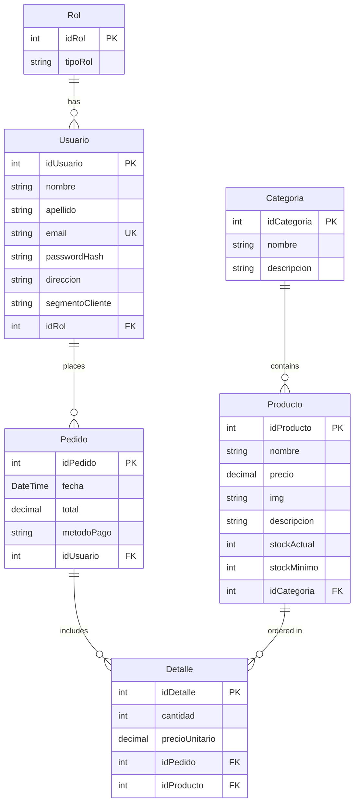

## Database Overview

Huellitas uses **PostgreSQL** as its database engine and **Entity Framework Core 9.0** as the Object-Relational Mapper (ORM). The database follows a relational design with six main tables.

## Database Schema



## Entity Models

### Usuario Entity

Represents customer and admin accounts:

```csharp Usuario.cs:8
[Table("Usuario")]
public class Usuario
{
    [Key]
    public int idUsuario { get; set; }
    
    [Required]
    [MaxLength(100)]
    public string nombre { get; set; } = string.Empty;
    
    [Required]
    [MaxLength(100)]
    public string apellido { get; set; } = string.Empty;
    
    [Required]
    [MaxLength(100)]
    [EmailAddress]
    public string email { get; set; } = string.Empty;
    
    [Required]
    public string passwordHash { get; set; } = string.Empty;
    
    [MaxLength(250)]
    public string direccion { get; set; } = string.Empty;
    
    [MaxLength(50)]
    public string segmentoCliente { get; set; } = string.Empty;
    
    // Relationship with Rol
    public int idRol { get; set; }
    [ForeignKey("idRol")]
    public virtual Rol rol { get; set; } = null!;
    
    // Navigation property: one user has many orders
    public virtual ICollection<Pedido> Pedidos { get; set; } = new List<Pedido>();
}
```

**Key Features:**
- `passwordHash` stores BCrypt-hashed passwords
- `segmentoCliente` for customer segmentation (VIP, Regular, etc.)
- Virtual navigation properties enable lazy loading

### Rol Entity

Defines user roles (Admin, Cliente):

```csharp Rol.cs:8
[Table("Rol")]
public class Rol
{
    [Key]
    public int idRol { get; set; }
    
    [Required]
    [MaxLength(50)]
    public string tipoRol { get; set; } = string.Empty;
    
    // Navigation property: one role has many users
    public virtual ICollection<Usuario> usuarios { get; set; } = new List<Usuario>();
}
```

### Producto Entity

Represents pet shop products:

```csharp Producto.cs:10
[Table("producto")]
public class Producto
{
    [Key]
    public int idProducto { get; set; }
    
    [Required]
    [MaxLength(100)]
    public string nombre { get; set; } = string.Empty;
    
    [Column(TypeName = "decimal(18,2)")]
    public decimal precio { get; set; }
    
    public string img { get; set; } = string.Empty;
    
    public string descripcion { get; set; } = string.Empty;
    
    public int stockActual { get; set; }
    
    public int stockMinimo { get; set; }
    
    // Relationship with Categoria
    public int idCategoria { get; set; }
    [ForeignKey("idCategoria")]
    public virtual Categoria Categoria { get; set; } = null!;
}
```

**Key Features:**
- `decimal(18,2)` ensures precise pricing (2 decimal places)
- `stockMinimo` for low stock alerts
- `img` stores image URL or path

### Categoria Entity

Product categories (Food, Toys, Accessories, etc.):

```csharp Categoria.cs:8
[Table("Categoria")]
public class Categoria
{
    [Key]
    public int idCategoria { get; set; }
    
    [Required]
    [MaxLength(100)]
    public string nombre { get; set; } = string.Empty;
    
    [MaxLength(255)]
    public string descripcion { get; set; } = string.Empty;
    
    // Navigation property: one category has many products
    public virtual ICollection<Producto> Productos { get; set; } = new List<Producto>();
}
```

### Pedido Entity

Represents customer orders:

```csharp Pedido.cs:8
[Table("Pedido")]
public class Pedido
{
    [Key]
    public int idPedido { get; set; }
    
    public DateTime fecha { get; set; } = DateTime.Now;
    
    [Column(TypeName = "decimal(18,2)")]
    public decimal total { get; set; }
    
    [MaxLength(50)]
    public string metodoPago { get; set; } = string.Empty;  // "tarjeta", "efectivo"
    
    // Relationship with Usuario
    public int idUsuario { get; set; }
    [ForeignKey("idUsuario")]
    public virtual Usuario Usuario { get; set; } = null!;
    
    // Navigation property: one order has many details
    public virtual ICollection<Detalle> detalles { get; set; } = new List<Detalle>();
}
```

### Detalle Entity

Order line items (products in an order):

```csharp Detalle.cs:8
[Table("Detalle")]
public class Detalle
{
    [Key]
    public int idDetalle { get; set; }
    
    public int cantidad { get; set; }
    
    [Column(TypeName = "decimal(18,2)")]
    public decimal precioUnitario { get; set; }
    
    // Relationship with Pedido
    [ForeignKey("idPedido")]
    public virtual Pedido Pedido { get; set; } = null!;
    
    // Relationship with Producto
    public int idProducto { get; set; }
    [ForeignKey("idProducto")]
    public virtual Producto producto { get; set; } = null!;
}
```

**Design Note:** `precioUnitario` is stored in Detalle to preserve historical pricing, even if product prices change later.

## DbContext Configuration

The `HuellitasContext` class manages database connections and entity sets:

```csharp huellitasContext.cs:6
public class HuellitasContext : DbContext
{
    public HuellitasContext(DbContextOptions<HuellitasContext> options) : base(options)
    {
    }
    
    // DbSets map to database tables
    public DbSet<Producto> Productos { get; set; }
    public DbSet<Categoria> Categorias { get; set; }
    public DbSet<Usuario> Usuarios { get; set; }
    public DbSet<Rol> Roles { get; set; }
    public DbSet<Pedido> Pedidos { get; set; }
    public DbSet<Detalle> Detalles { get; set; }
}
```

### Connection String Registration

Registered in `Program.cs:51-52`:

```csharp Program.cs:51
builder.Services.AddDbContext<HuellitasContext>(options =>
    options.UseNpgsql(builder.Configuration.GetConnectionString("DefaultConnection")));
```

### Connection String Format

```json appsettings.json
{
  "ConnectionStrings": {
    "DefaultConnection": "Host=localhost;Database=huellitas;Username=postgres;Password=yourpassword"
  }
}
```

## Entity Framework Migrations

### Creating Migrations

Migrations track database schema changes over time:

```bash
# Create a new migration
dotnet ef migrations add MigrationName --project Huellitas.Data --startup-project Huellitas.API

# Apply migrations to database
dotnet ef database update --project Huellitas.API

# Rollback to specific migration
dotnet ef database update PreviousMigrationName --project Huellitas.API
```

### Initial Migration

The first migration creates Categoria and Producto tables:

```csharp 20251226222715_Inicial.cs:14
migrationBuilder.CreateTable(
    name: "Categoria",
    columns: table => new
    {
        idCategoria = table.Column<int>(type: "integer", nullable: false)
            .Annotation("Npgsql:ValueGenerationStrategy", NpgsqlValueGenerationStrategy.IdentityByDefaultColumn),
        nombre = table.Column<string>(type: "character varying(100)", maxLength: 100, nullable: false),
        descripcion = table.Column<string>(type: "character varying(255)", maxLength: 255, nullable: false)
    },
    constraints: table =>
    {
        table.PrimaryKey("PK_Categoria", x => x.idCategoria);
    });

migrationBuilder.CreateTable(
    name: "producto",
    columns: table => new
    {
        idProducto = table.Column<int>(type: "integer", nullable: false)
            .Annotation("Npgsql:ValueGenerationStrategy", NpgsqlValueGenerationStrategy.IdentityByDefaultColumn),
        nombre = table.Column<string>(type: "character varying(100)", maxLength: 100, nullable: false),
        precio = table.Column<decimal>(type: "numeric(18,2)", nullable: false),
        // ... other columns
        idCategoria = table.Column<int>(type: "integer", nullable: false)
    },
    constraints: table =>
    {
        table.PrimaryKey("PK_producto", x => x.idProducto);
        table.ForeignKey(
            name: "FK_producto_Categoria_idCategoria",
            column: x => x.idCategoria,
            principalTable: "Categoria",
            principalColumn: "idCategoria",
            onDelete: ReferentialAction.Cascade);
    });
```

### Migration History

1. **20251226222715_Inicial** - Created Categoria and Producto tables
2. **20251226224227_AgregandoTablasRestantes** - Added Usuario, Rol, Pedido, and Detalle tables

## Repository Pattern

Repositories abstract database operations. Example for products:

### Interface Definition

```csharp IProductoRepositorio.cs:6
public interface IProductoRepositorio
{
    Task<IEnumerable<Producto>> ObtenerTodosAsync();
    Task<Producto?> ObtenerPorIdAsync(int id);
    Task<Producto> CrearAsync(Producto producto);
    Task<Producto> ActualizarAsync(Producto producto);
    Task EliminarAsync(Producto producto);
}
```

### Implementation

```csharp ProductoRepositorio.cs:10
public class ProductoRepositorio : IProductoRepositorio
{
    private readonly HuellitasContext _context;
    
    public ProductoRepositorio(HuellitasContext context)
    {
        _context = context;
    }
    
    public async Task<IEnumerable<Producto>> ObtenerTodosAsync()
    {
        return await _context.Productos.ToListAsync();
    }
    
    public async Task<Producto?> ObtenerPorIdAsync(int id)
    {
        return await _context.Productos.FindAsync(id);
    }
    
    public async Task<Producto> CrearAsync(Producto producto)
    {
        await _context.Productos.AddAsync(producto);
        await _context.SaveChangesAsync();
        return producto;
    }
    
    public async Task<Producto> ActualizarAsync(Producto producto)
    {
        _context.Entry(producto).State = EntityState.Modified;
        await _context.SaveChangesAsync();
        return producto;
    }
    
    public async Task EliminarAsync(Producto producto)
    {
        _context.Productos.Remove(producto);
        await _context.SaveChangesAsync();
    }
}
```

## Common Queries

### Eager Loading (Include Related Data)

```csharp
// Load products with their categories
var productos = await _context.Productos
    .Include(p => p.Categoria)
    .ToListAsync();

// Load orders with user and order details
var pedidos = await _context.Pedidos
    .Include(p => p.Usuario)
    .Include(p => p.detalles)
        .ThenInclude(d => d.producto)
    .ToListAsync();
```

### Filtering and Sorting

```csharp
// Products below minimum stock
var lowStock = await _context.Productos
    .Where(p => p.stockActual <= p.stockMinimo)
    .OrderBy(p => p.stockActual)
    .ToListAsync();

// Orders for specific user
var userOrders = await _context.Pedidos
    .Where(p => p.idUsuario == userId)
    .OrderByDescending(p => p.fecha)
    .ToListAsync();
```

### Aggregations

```csharp
// Total sales
var totalVentas = await _context.Pedidos
    .SumAsync(p => p.total);

// Product count by category
var productsByCategory = await _context.Productos
    .GroupBy(p => p.Categoria.nombre)
    .Select(g => new { Categoria = g.Key, Count = g.Count() })
    .ToListAsync();
```

## Database Seeding

For development, seed initial data:

```csharp
// Add to HuellitasContext.cs
protected override void OnModelCreating(ModelBuilder modelBuilder)
{
    base.OnModelCreating(modelBuilder);
    
    // Seed roles
    modelBuilder.Entity<Rol>().HasData(
        new Rol { idRol = 1, tipoRol = "Admin" },
        new Rol { idRol = 2, tipoRol = "Cliente" }
    );
    
    // Seed categories
    modelBuilder.Entity<Categoria>().HasData(
        new Categoria { idCategoria = 1, nombre = "Alimentos", descripcion = "Comida para mascotas" },
        new Categoria { idCategoria = 2, nombre = "Juguetes", descripcion = "Juguetes y entretenimiento" },
        new Categoria { idCategoria = 3, nombre = "Accesorios", descripcion = "Collares, correas, etc." }
    );
}
```

Then create a migration:

```bash
dotnet ef migrations add SeedInitialData --project Huellitas.Data --startup-project Huellitas.API
dotnet ef database update --project Huellitas.API
```

## Connection Pooling

Entity Framework Core automatically manages connection pooling. Configure in connection string:

```
Host=localhost;Database=huellitas;Username=postgres;Password=pass;Pooling=true;MinPoolSize=5;MaxPoolSize=100;
```

## Best Practices

<AccordionGroup>
  <Accordion title="Always Use Async Methods">
    Use `ToListAsync()`, `FirstOrDefaultAsync()`, `SaveChangesAsync()` to avoid blocking threads.
  </Accordion>
  
  <Accordion title="Dispose DbContext Properly">
    Use dependency injection with scoped lifetime. ASP.NET Core handles disposal automatically.
  </Accordion>
  
  <Accordion title="Use Include for Related Data">
    Avoid N+1 query problems by using `.Include()` to load related entities in one query.
  </Accordion>
  
  <Accordion title="Validate Input">
    Use data annotations (`[Required]`, `[MaxLength]`) for basic validation. Add business logic validation in services.
  </Accordion>
  
  <Accordion title="Use Transactions for Multi-Step Operations">
    Wrap multiple operations in `_context.Database.BeginTransaction()` for atomicity.
  </Accordion>
</AccordionGroup>

## Troubleshooting

### Migration Errors

**Issue:** "Build failed" during migration.

**Solution:** Ensure all projects compile successfully before creating migrations.

```bash
dotnet build
```

### Connection Refused

**Issue:** "Connection refused" to PostgreSQL.

**Solution:** Check PostgreSQL is running and connection string is correct:

```bash
sudo systemctl status postgresql
psql -h localhost -U postgres -d huellitas
```

### Foreign Key Constraint Violation

**Issue:** Cannot insert/delete due to foreign key constraint.

**Solution:** Ensure referenced entities exist before inserting, or use `OnDelete: ReferentialAction.Cascade` for automatic deletion.

## Performance Tips

### Use AsNoTracking for Read-Only Queries

```csharp
// Faster for read-only operations
var productos = await _context.Productos
    .AsNoTracking()
    .ToListAsync();
```

### Projection for Specific Fields

```csharp
// Select only needed fields
var productNames = await _context.Productos
    .Select(p => new { p.idProducto, p.nombre, p.precio })
    .ToListAsync();
```

### Batch Operations

```csharp
// Add multiple entities at once
_context.Productos.AddRange(productosList);
await _context.SaveChangesAsync();
```

## Next Steps

<CardGroup cols={2}>
  <Card title="Setup Guide" icon="gear" href="/backend/setup">
    Configure your development environment
  </Card>
  <Card title="Authentication" icon="lock" href="/backend/authentication">
    Learn about JWT and user management
  </Card>
</CardGroup>