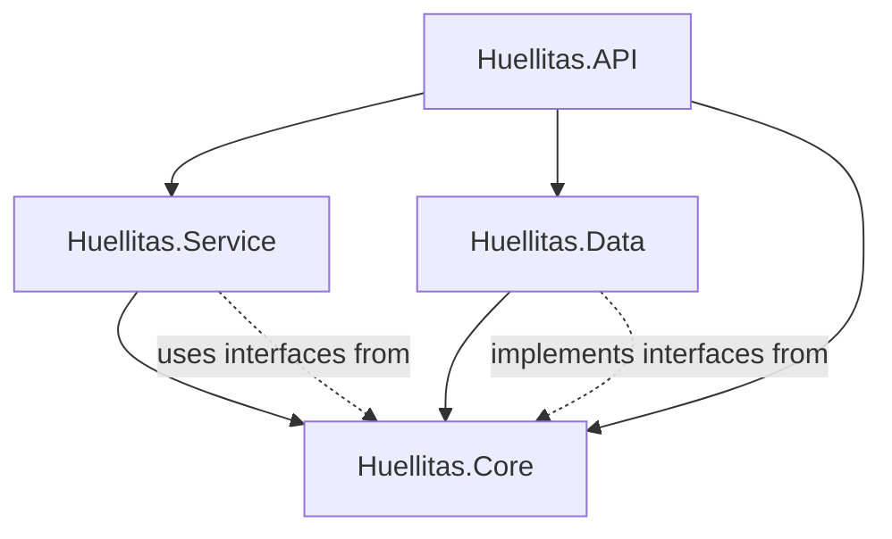

## Architecture Overview

The Huellitas backend follows a **clean architecture** pattern, separating concerns into four distinct projects:

```
Huellitas.sln
├── Huellitas.API        → Presentation Layer
├── Huellitas.Core       → Domain Layer
├── Huellitas.Data       → Data Access Layer
└── Huellitas.Service    → Business Logic Layer
```

This separation ensures:
- **Maintainability** - Each layer has a single responsibility
- **Testability** - Easy to unit test business logic independently
- **Scalability** - Can swap implementations without affecting other layers
- **Dependency Flow** - Dependencies point inward (API → Service → Data → Core)

## Project Details

### Huellitas.Core (Domain Layer)

The **core** project contains domain entities, data transfer objects (DTOs), and interfaces. It has **no dependencies** on other projects.

#### Directory Structure

```
Huellitas.Core/
├── Entities/
│   ├── Usuario.cs
│   ├── Rol.cs
│   ├── Producto.cs
│   ├── Categoria.cs
│   ├── Pedido.cs
│   └── Detalle.cs
├── DTO/
│   ├── Auth/
│   │   └── LoginDto.cs
│   ├── ProductoDTO.cs
│   └── ProductoCreacionDTO.cs
├── Interfaces/
│   ├── IProductoRepositorio.cs
│   ├── IUsuarioRepositorio.cs
│   └── IPedidoRepositorio.cs
└── Huellitas.Core.csproj
```

#### Key Components

**Entities** define the domain models with Entity Framework annotations:

```csharp Usuario.cs:8
[Table("Usuario")]
public class Usuario
{
    [Key]
    public int idUsuario {get; set;}
    
    [Required]
    [MaxLength(100)]
    public string nombre {get; set;} = string.Empty;
    
    [Required]
    [MaxLength(100)]
    [EmailAddress]
    public string email {get; set;} = string.Empty;
    
    [Required]
    public string passwordHash {get; set;} = string.Empty;
    
    // Foreign key relationship
    public int idRol {get; set;}
    [ForeignKey("idRol")]
    public virtual Rol rol {get; set;} = null!;
    
    // Navigation property
    public virtual ICollection<Pedido> Pedidos {get; set;} = new List<Pedido>();
}
```

**Interfaces** define contracts for repositories:

```csharp IProductoRepositorio.cs:6
public interface IProductoRepositorio
{
    Task<IEnumerable<Producto>> ObtenerTodosAsync();
    Task<Producto?> ObtenerPorIdAsync(int id);
    Task<Producto> CrearAsync(Producto producto);
    Task<Producto> ActualizarAsync(Producto producto);
    Task EliminarAsync(Producto producto);
}
```

---

### Huellitas.Data (Data Access Layer)

The **data** project handles database operations using Entity Framework Core and implements repository interfaces.

#### Directory Structure

```
Huellitas.Data/
├── Repositorios/
│   ├── ProductoRepositorio.cs
│   ├── UsuarioRepositorio.cs
│   └── PedidoRepositorio.cs
├── Migrations/
│   ├── 20251226222715_Inicial.cs
│   ├── 20251226224227_AgregandoTablasRestantes.cs
│   └── HuellitasContextModelSnapshot.cs
├── huellitasContext.cs
└── Huellitas.Data.csproj
```

**Dependencies:**
- `Huellitas.Core` - References entities and interfaces
- `Npgsql.EntityFrameworkCore.PostgreSQL` - PostgreSQL provider
- `Microsoft.EntityFrameworkCore` - ORM framework

#### DbContext Implementation

```csharp huellitasContext.cs:6
public class HuellitasContext : DbContext
{
    public HuellitasContext(DbContextOptions<HuellitasContext> options) : base(options)
    {
    }
    
    // DbSets represent database tables
    public DbSet<Producto> Productos { get; set; }
    public DbSet<Categoria> Categorias { get; set; }
    public DbSet<Usuario> Usuarios { get; set; }
    public DbSet<Rol> Roles { get; set; }
    public DbSet<Pedido> Pedidos { get; set; }
    public DbSet<Detalle> Detalles { get; set; }
}
```

#### Repository Pattern

```csharp ProductoRepositorio.cs:10
public class ProductoRepositorio : IProductoRepositorio
{
    private readonly HuellitasContext _context;
    
    public ProductoRepositorio(HuellitasContext context)
    {
        _context = context;
    }
    
    public async Task<IEnumerable<Producto>> ObtenerTodosAsync()
    {
        return await _context.Productos.ToListAsync();
    }
    
    public async Task<Producto?> ObtenerPorIdAsync(int id)
    {
        return await _context.Productos.FindAsync(id);
    }
    
    public async Task<Producto> CrearAsync(Producto producto)
    {
        await _context.Productos.AddAsync(producto);
        await _context.SaveChangesAsync();
        return producto;
    }
}
```

---

### Huellitas.Service (Business Logic Layer)

The **service** project implements business logic, validation, and orchestrates repository calls.

#### Directory Structure

```
Huellitas.Service/
├── Interfaces/
│   ├── IProductoService.cs
│   ├── IAuthService.cs
│   └── IPedidoService.cs
├── ProductoService.cs
├── AuthService.cs
├── PedidoService.cs
└── Huellitas.Service.csproj
```

**Dependencies:**
- `Huellitas.Core` - Uses entities and repository interfaces
- `BCrypt.Net` - Password hashing
- `System.IdentityModel.Tokens.Jwt` - JWT generation

#### Service Layer Pattern

```csharp ProductoService.cs:9
public class ProductoService : IProductoService
{
    private readonly IProductoRepositorio _productoRepositorio;
    
    public ProductoService(IProductoRepositorio productoRepositorio)
    {
        _productoRepositorio = productoRepositorio;
    }
    
    public async Task<Producto> CrearProductoAsync(Producto producto)
    {
        // Business logic validation
        if (producto.precio < 0)
        {
            throw new Exception("El precio no puede ser negativo");
        }
        
        return await _productoRepositorio.CrearAsync(producto);
    }
    
    public async Task<bool> EliminarProductoAsync(int id)
    {
        var producto = await _productoRepositorio.ObtenerPorIdAsync(id);
        if (producto == null) { return false; }
        
        await _productoRepositorio.EliminarAsync(producto);
        return true;
    }
}
```

---

### Huellitas.API (Presentation Layer)

The **API** project exposes HTTP endpoints and handles web-specific concerns.

#### Directory Structure

```
Huellitas.API/
├── Controllers/
│   ├── AuthController.cs
│   ├── ProductosController.cs
│   └── PedidosController.cs
├── Properties/
│   └── launchSettings.json
├── Program.cs
├── Dockerfile
└── Huellitas.API.csproj
```

**Dependencies:**
- `Huellitas.Core` - Uses entities and DTOs
- `Huellitas.Data` - Registers DbContext
- `Huellitas.Service` - Uses service interfaces
- `Microsoft.AspNetCore.Authentication.JwtBearer` - JWT middleware
- `Swashbuckle.AspNetCore` - Swagger/OpenAPI

#### Controller Example

```csharp ProductosController.cs:15
[Route("api/[controller]")]
[ApiController]
public class ProductosController : ControllerBase
{
    private readonly IProductoService _productoService;
    
    public ProductosController(IProductoService productoService)
    {
        _productoService = productoService;
    }
    
    [HttpGet]
    public async Task<ActionResult<IEnumerable<Producto>>> GetProductos()
    {
        var productos = await _productoService.ObtenerProductosAsync();
        return Ok(productos);
    }
    
    [HttpPost]
    public async Task<ActionResult<Producto>> PostProducto(Producto producto)
    {
        try
        {
            var nuevoProducto = await _productoService.CrearProductoAsync(producto);
            return CreatedAtAction(nameof(GetProducto), 
                new { id = nuevoProducto.idProducto }, 
                nuevoProducto);
        }
        catch (SystemException ex)
        {
            return BadRequest(ex.Message);
        }
    }
}
```

## Dependency Graph



## Project References

From `Huellitas.API.csproj`:

```xml
<ItemGroup>
  <ProjectReference Include="..\Huellitas.Data\Huellitas.Data.csproj" />
  <ProjectReference Include="..\Huellitas.Core\Huellitas.Core.csproj" />
  <ProjectReference Include="..\Huellitas.Service\Huellitas.Service.csproj" />
</ItemGroup>
```

## Key Design Patterns

### Repository Pattern
- Abstracts data access logic
- Implemented in `Huellitas.Data`
- Interfaces defined in `Huellitas.Core`

### Service Pattern
- Encapsulates business logic
- Separates controllers from data access
- Enables easy unit testing

### Dependency Injection
- All dependencies injected via constructor
- Configured in `Program.cs:65-68`
- Uses ASP.NET Core DI container

### Async/Await
- All database operations use async methods
- Improves scalability and responsiveness
- Pattern: `Task<T>` return types

## Benefits of This Architecture

<AccordionGroup>
  <Accordion title="Separation of Concerns">
    Each project has a clear responsibility. Controllers handle HTTP, services handle business logic, repositories handle data access.
  </Accordion>
  
  <Accordion title="Testability">
    Business logic in services can be unit tested without touching the database by mocking repositories.
  </Accordion>
  
  <Accordion title="Flexibility">
    Can swap PostgreSQL for SQL Server by only changing the Data project.
  </Accordion>
  
  <Accordion title="Team Scalability">
    Multiple developers can work on different layers simultaneously without conflicts.
  </Accordion>
</AccordionGroup>

## Next Steps

<CardGroup cols={2}>
  <Card title="Authentication" icon="lock" href="/backend/authentication">
    Explore JWT authentication implementation
  </Card>
  <Card title="Database" icon="database" href="/backend/database">
    Learn about Entity Framework and data models
  </Card>
</CardGroup>