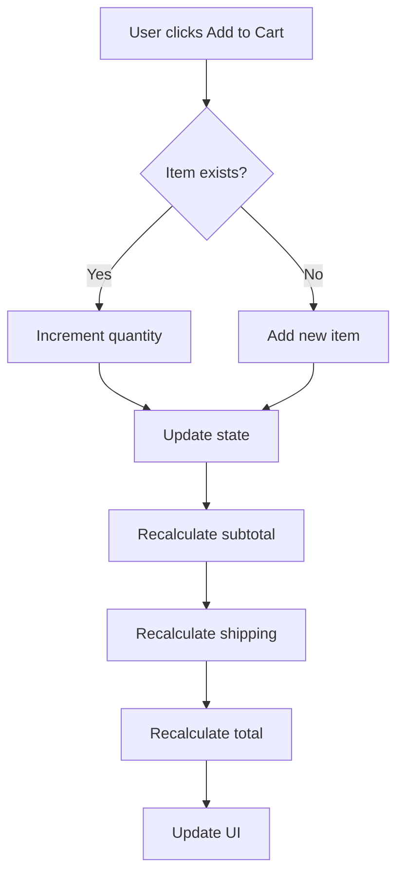

## Overview

The shopping cart is implemented using React Context API for global state management. It provides cart operations, automatic price calculations, and persistent state across the application.

## Architecture

<Steps>
  <Step title="Context Provider">
    `CarritoContext` wraps the entire app and provides cart state
  </Step>
  <Step title="Custom Hook">
    `useCarrito` hook provides access to cart operations
  </Step>
  <Step title="Cart Components">
    Specialized components for displaying and managing cart items
  </Step>
</Steps>

## Context Implementation

### CarritoContext Provider

```jsx src/context/CarritoContext.jsx
import { createContext, useContext, useState } from "react";

const CarritoContext = createContext();

export const CarritoProvider = ({ children }) => {
  const [items, setItems] = useState([]);

  const agregarAlCarrito = (producto) => {
    setItems(prev => {
      const existe = prev.find(i => i.id === producto.id);
      if (existe) {
        return prev.map(i =>
          i.id === producto.id ? { ...i, cantidad: i.cantidad + 1 } : i
        );
      }
      return [...prev, { ...producto, cantidad: 1 }];
    });
  };

  const updateCantidad = (id, cantidad) => {
    if (cantidad < 1) return;
    setItems(prev => prev.map(i => i.id === id ? { ...i, cantidad } : i));
  };

  const removeItem = (id) =>
    setItems(prev => prev.filter(i => i.id !== id));

  const subtotal = items.reduce((sum, i) => sum + i.precio * i.cantidad, 0);
  const envio    = subtotal > 5000 ? 0 : 800;
  const total    = subtotal + envio;

  return (
    <CarritoContext.Provider value={{
      items,
      agregarAlCarrito,
      updateCantidad,
      removeItem,
      subtotal,
      envio,
      total,
    }}>
      {children}
    </CarritoContext.Provider>
  );
};

export const useCarrito = () => useContext(CarritoContext);
export default useCarrito;
```

<Accordion title="File Location">
  `src/context/CarritoContext.jsx`
</Accordion>

## State Structure

### Cart Item Object

```typescript
interface CartItem {
  id: number;           // Product ID
  nombre: string;       // Product name
  precio: number;       // Unit price in ARS
  img?: string;         // Product image URL
  talle?: string;       // Size (optional)
  cantidad: number;     // Quantity in cart
}
```

### Context Value

<ParamField path="items" type="CartItem[]">
  Array of items currently in the cart
</ParamField>

<ParamField path="agregarAlCarrito" type="function">
  Add a product to the cart or increment quantity if it exists
  
  ```typescript
  (producto: Product) => void
  ```
</ParamField>

<ParamField path="updateCantidad" type="function">
  Update the quantity of a cart item
  
  ```typescript
  (id: number, cantidad: number) => void
  ```
</ParamField>

<ParamField path="removeItem" type="function">
  Remove an item from the cart
  
  ```typescript
  (id: number) => void
  ```
</ParamField>

<ParamField path="subtotal" type="number">
  Sum of all items (price × quantity)
</ParamField>

<ParamField path="envio" type="number">
  Shipping cost (800 ARS or free if subtotal > 5000)
</ParamField>

<ParamField path="total" type="number">
  Final total (subtotal + shipping)
</ParamField>

## Cart Operations

### Adding Items

When adding a product to the cart:

1. Check if the product already exists in the cart
2. If it exists, increment the quantity by 1
3. If it's new, add it with quantity 1

```jsx
const agregarAlCarrito = (producto) => {
  setItems(prev => {
    const existe = prev.find(i => i.id === producto.id);
    if (existe) {
      // Increment existing item
      return prev.map(i =>
        i.id === producto.id ? { ...i, cantidad: i.cantidad + 1 } : i
      );
    }
    // Add new item
    return [...prev, { ...producto, cantidad: 1 }];
  });
};
```

<Info>
  Products with the same ID are treated as the same item, even if they have different attributes. The quantity is simply incremented.
</Info>

### Updating Quantity

Update the quantity of a specific item:

```jsx
const updateCantidad = (id, cantidad) => {
  if (cantidad < 1) return; // Prevent quantity < 1
  setItems(prev => prev.map(i => i.id === id ? { ...i, cantidad } : i));
};
```

<Warning>
  The minimum quantity is 1. To remove an item, use `removeItem` instead of setting quantity to 0.
</Warning>

### Removing Items

Remove an item completely from the cart:

```jsx
const removeItem = (id) =>
  setItems(prev => prev.filter(i => i.id !== id));
```

## Price Calculations

### Subtotal

Sum of all items (unit price × quantity):

```jsx
const subtotal = items.reduce((sum, i) => sum + i.precio * i.cantidad, 0);
```

### Shipping Cost

Free shipping for orders over 5000 ARS:

```jsx
const envio = subtotal > 5000 ? 0 : 800;
```

<CardGroup cols={2}>
  <Card title="Standard Shipping" icon="truck">
    800 ARS for orders under 5000 ARS
  </Card>
  <Card title="Free Shipping" icon="truck-fast">
    Free for orders 5000 ARS and above
  </Card>
</CardGroup>

### Total

Final amount including shipping:

```jsx
const total = subtotal + envio;
```

## Using the Cart Hook

### In Components

```jsx
import useCarrito from "../../hooks/useCarrito";

function ProductCard({ producto }) {
  const { agregarAlCarrito } = useCarrito();

  const handleAdd = () => {
    agregarAlCarrito({
      id: producto.idProducto,
      nombre: producto.nombre,
      precio: producto.precio,
      img: producto.img,
      talle: producto.talle ?? null,
    });
  };

  return (
    <button onClick={handleAdd}>
      Agregar al carrito
    </button>
  );
}
```

### In Cart Page

```jsx src/pages/Cart/Carrito.jsx
import useCarrito from "../../hooks/useCarrito";
import CarritoItem from "../../components/Carrito/CarritoItem";
import CarritoResumen from "../../components/Carrito/CarritoResumen";
import CarritoVacio from "../../components/Carrito/CarritoVacio";

export const Carrito = () => {
  const { items, updateCantidad, removeItem, subtotal, envio, total } = useCarrito();

  if (items.length === 0) return <CarritoVacio/>;

  return (
    <div>
      <h1>Mi Carrito</h1>
      <p>{items.length} producto{items.length !== 1 ? "s" : ""} en tu carrito</p>

      <div style={{ display: "grid", gridTemplateColumns: "1fr 360px" }}>
        {/* Lista productos */}
        <div>
          {items.map(item => (
            <CarritoItem
              key={item.id}
              item={item}
              updateCantidad={updateCantidad}
              removeItem={removeItem}
            />
          ))}
        </div>

        {/* Resumen */}
        <CarritoResumen subtotal={subtotal} envio={envio} total={total}/>
      </div>
    </div>
  );
};
```

<Accordion title="File Location">
  `src/pages/Cart/Carrito.jsx`
</Accordion>

## Cart Components

### CarritoItem

Displays a single cart item with controls:

- Product image and name
- Unit price
- Quantity controls (+/-)
- Line total (price × quantity)
- Remove button

See [Components](/frontend/components) for implementation details.

### CarritoResumen

Displays order summary:

```jsx
function CarritoResumen({ subtotal, envio, total }) {
  return (
    <div className="summary-panel">
      <h3>Resumen del pedido</h3>
      
      <div className="summary-row">
        <span>Subtotal</span>
        <span>${subtotal.toLocaleString("es-AR")}</span>
      </div>
      
      <div className="summary-row">
        <span>Envío</span>
        <span>
          {envio === 0 
            ? "Gratis" 
            : `$${envio.toLocaleString("es-AR")}`
          }
        </span>
      </div>
      
      <div className="summary-row total">
        <span>Total</span>
        <span>${total.toLocaleString("es-AR")}</span>
      </div>
      
      <button>Finalizar compra</button>
    </div>
  );
}
```

### CarritoVacio

Empty state component when cart has no items:

```jsx
function CarritoVacio() {
  return (
    <div className="empty-cart">
      <span style={{ fontSize: "4rem" }}>🛒</span>
      <h2>Tu carrito está vacío</h2>
      <p>Agrega productos para comenzar tu compra</p>
      <Link to="/">
        <button>Ver productos</button>
      </Link>
    </div>
  );
}
```

## State Management Flow



## Hook Export Pattern

The `useCarrito` hook is exported in two ways:

```jsx src/context/CarritoContext.jsx
// Named export
export const useCarrito = () => useContext(CarritoContext);

// Default export
export default useCarrito;
```

And re-exported from a dedicated hooks file:

```jsx src/hooks/useCarrito.js
export { useCarrito as default } from "../context/CarritoContext";
```

This allows both import styles:

```jsx
// Default import
import useCarrito from "../../hooks/useCarrito";

// Named import
import { useCarrito } from "../../context/CarritoContext";
```

## Future Enhancements

<CardGroup cols={2}>
  <Card title="LocalStorage Persistence" icon="floppy-disk">
    Save cart state to localStorage to persist across page refreshes
  </Card>
  
  <Card title="Cart Badge Counter" icon="bell">
    Show total item count in the header cart icon
  </Card>
  
  <Card title="Product Variants" icon="layer-group">
    Support different sizes/colors as separate cart items
  </Card>
  
  <Card title="Discount Codes" icon="ticket">
    Apply promotional codes to the cart total
  </Card>
</CardGroup>

## Adding LocalStorage Persistence

Example implementation for persisting cart state:

```jsx
import { createContext, useContext, useState, useEffect } from "react";

const CART_STORAGE_KEY = "huellitas_cart";

export const CarritoProvider = ({ children }) => {
  // Initialize from localStorage
  const [items, setItems] = useState(() => {
    const saved = localStorage.getItem(CART_STORAGE_KEY);
    return saved ? JSON.parse(saved) : [];
  });

  // Save to localStorage on every change
  useEffect(() => {
    localStorage.setItem(CART_STORAGE_KEY, JSON.stringify(items));
  }, [items]);

  // ... rest of implementation
};
```

<Warning>
  Be careful with localStorage in SSR environments. Always check if `window` is defined before accessing localStorage.
</Warning>

## Testing the Cart

### Manual Testing Checklist

<Steps>
  <Step title="Add items">
    Add multiple products and verify quantity increments for duplicates
  </Step>
  
  <Step title="Update quantities">
    Use +/- buttons to change quantities and verify price updates
  </Step>
  
  <Step title="Remove items">
    Delete items and verify they're removed from the list
  </Step>
  
  <Step title="Check calculations">
    Verify subtotal, shipping (free over 5000), and total are correct
  </Step>
  
  <Step title="Empty cart">
    Remove all items and verify empty state is shown
  </Step>
</Steps>

## Next Steps

<CardGroup cols={2}>
  <Card title="Components" icon="puzzle-piece" href="/frontend/components">
    Learn about cart UI components
  </Card>
  <Card title="Backend API" icon="server" href="/backend/setup">
    Connect cart to backend checkout
  </Card>
</CardGroup>
